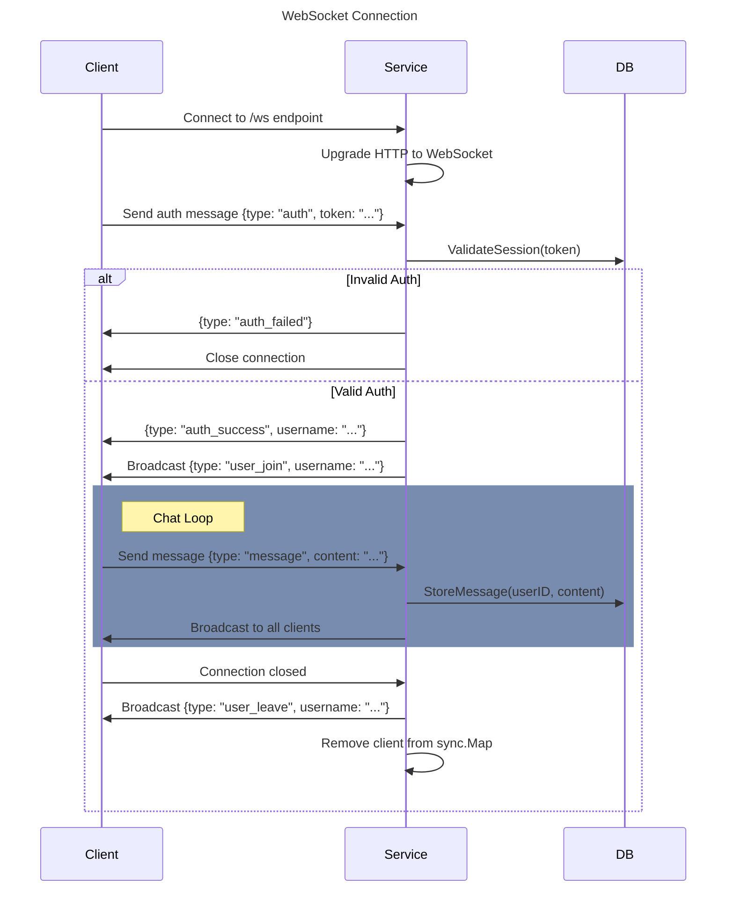
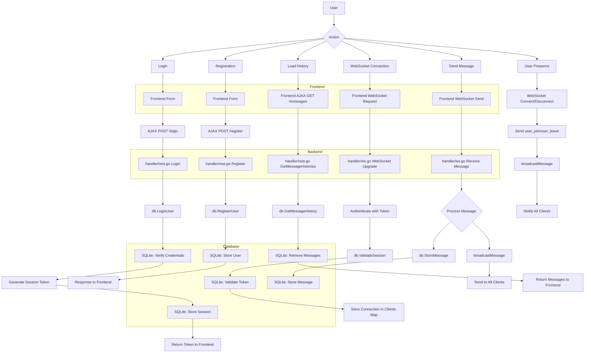

# Diagram
## Sequence Diagram for WebSocket Connection

```mermaid
    sequenceDiagram
        title WebSocket Connection
        participant Client
        participant Service
        participant DB
        
        %% Authentication Flow
        Client->>Service: Connect to /ws endpoint
        Service->>Service: Upgrade HTTP to WebSocket
        Client->>Service: Send auth message {type: "auth", token: "..."}
        Service->>DB: ValidateSession(token)
        
        alt Invalid Auth
            Service->>Client: {type: "auth_failed"}
            Service->>Client: Close connection
        else Valid Auth
            Service->>Client: {type: "auth_success", username: "..."}
            Service->>Client: Broadcast {type: "user_join", username: "..."}
            
            %% Message Flow
            rect rgb(120, 140, 175)
                note right of Client: Chat Loop
                Client->>Service: Send message {type: "message", content: "..."}
                Service->>DB: StoreMessage(userID, content)
                Service->>Client: Broadcast to all clients
            end
            
            %% Disconnect Flow
            Client->>Service: Connection closed
            Service->>Client: Broadcast {type: "user_leave", username: "..."}
            Service->>Service: Remove client from sync.Map
        end
```

## Flowchart for User Actions

```mermaid
flowchart TD
    A[User] --> B{Action}
    
    B --> C[Registration]
    C --> D[Frontend Form]
    D --> E[AJAX POST /register]
    E --> F[handler/rest.go Register]
    F --> G[db.RegisterUser]
    G --> H[SQLite: Store User]
    H --> I[Response to Frontend]
    
    B --> J[Login]
    J --> K[Frontend Form]
    K --> L[AJAX POST /login]
    L --> M[handler/rest.go Login]
    M --> N[db.LoginUser]
    N --> O[SQLite: Verify Credentials]
    O --> P[Generate Session Token]
    P --> Q[SQLite: Store Session]
    Q --> R[Return Token to Frontend]
    
    B --> S[WebSocket Connection]
    S --> T[Frontend WebSocket Request]
    T --> U[handler/ws.go WebSocket Upgrade]
    U --> V[Authenticate with Token]
    V --> W[db.ValidateSession]
    W --> X[SQLite: Validate Token]
    X --> Y[Store Connection in Clients Map]
    
    B --> Z[Send Message]
    Z --> AA[Frontend WebSocket Send]
    AA --> AB[handler/ws.go Receive Message]
    AB --> AC{Process Message}
    AC --> AD[db.StoreMessage]
    AD --> AE[SQLite: Store Message]
    AC --> AF[broadcastMessage]
    AF --> AG[Send to All Clients]
    
    B --> AH[Load History]
    AH --> AI[Frontend AJAX GET /messages]
    AI --> AJ[handler/rest.go GetMessageHistories]
    AJ --> AK[db.GetMessageHistory]
    AK --> AL[SQLite: Retrieve Messages]
    AL --> AM[Return Messages to Frontend]
    
    B --> AN[User Presence]
    AN --> AO[WebSocket Connect/Disconnect]
    AO --> AP[Send user_join/user_leave]
    AP --> AQ[broadcastMessage]
    AQ --> AR[Notify All Clients]
    
    subgraph Database
        direction TB
        H
        O
        Q
        X
        AE
        AL
    end
    
    subgraph Backend
        direction TB
        F
        M
        U
        AB
        AJ
    end
    
    subgraph Frontend
        direction TB
        D
        K
        T
        AA
        AI
    end
```