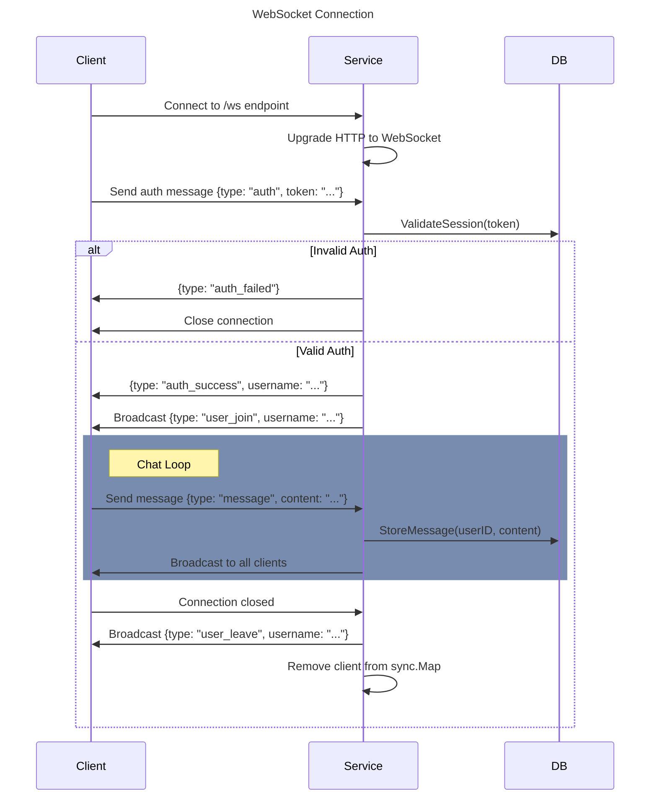

# Userflow
1. user open the website
2. user has account?
    - if user has account -> user login
    - if user doesn't have account -> user register
3. user login
    - if user credentials invalid -> send {type: "auth_failed"} to client
    - if user credentials valid
        - send {type: "auth_success", username: "..."} to client
        - broadcast {type: "user_join", username: "..."} to all clients
4. retrieve history -> http GET /messages?token=...
5. user send message -> http POST /messages?token=... {message: "..."}
6. user leave/close the website
    - broadcast {type: "user_leave", username: "..."} to all clients
    - close the websocket connection

## Diagram
### WebSocket Connection
